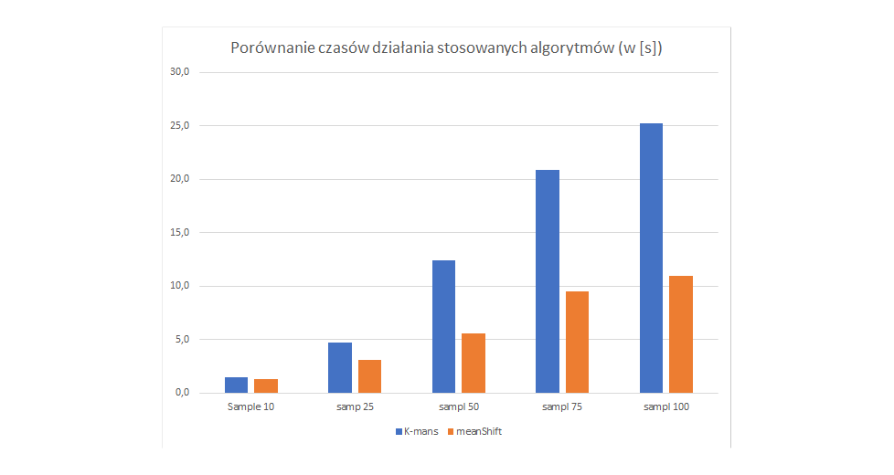
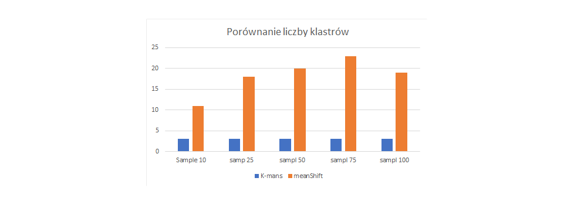
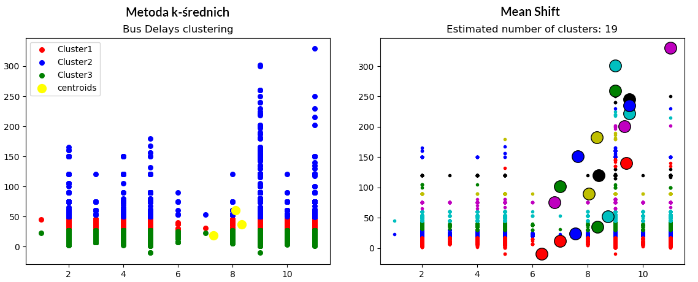
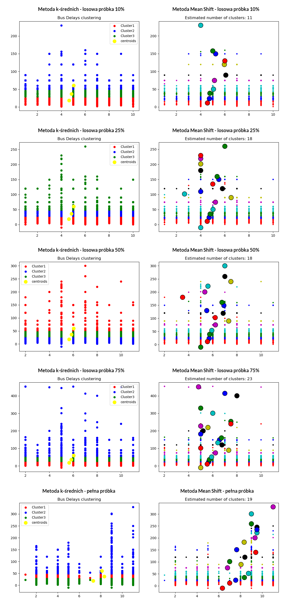

## School bus delays in New York - Data analysis (clustering) [PL]

##### Akademia Górniczo Hutnicza im. Stanisława Staszica w Krakowie   Wydział Zarządzania, Informatyka i Ekonometria, Uczenie maszynowe
###### Prowadzący: dr inż. Maciej Wielgosz, dr inż. Marcin Pietroń   Opracowanie: Mateusz Feć, Patryk Zieliński, Kraków 2019

## Wprowadzenie
Celem projektu jest wykorzystanie metod analizy skupień do przeanalizowania powodów, przyczyn oraz efektów opóźnień autobusów szkolnych w Nowm Jorku. Dane pochodzą z serwisu [Kaggle](https://www.kaggle.com/new-york-city/ny-bus-breakdown-and-delays) na licencji [CCO public domain](https://creativecommons.org/share-your-work/public-domain/cc0/). Szczegółowy opis danych znajduje się poniżej.

## Opis danych
1. **Zmienne kategoryczne**
    * Delay_Reason - zmienna kategoryczna przyjmująca wartości **1-10** w zależności od rozpoznanych przyczyn awarii,tj.:
        * 1 - przyczyna nierozpoznana/nie została zgłoszona
        * 2 - wypadek
        * 3 - opóźnienie przez szkołę
        * 4 - przebita opona
        * 5 - wysokie natężenie ruchu
        * 6 - późny powrót z wycieczki
        * 7 - usterka mechaniczna
        * 8 - inne
        * 9 - problem z wyjazdem
        * 10 - warunki pogodowe
        * 11 - brak możliwości uruchomienia zapłonu
    * School_Year - rok szkolny
        * 1 - 2015/16
        * 2 - 2016/17
        * 3 - 2017/18
        * 4 - 2018/19
    * School_Level - jeden z dwóch poziomów edukacji
        * 1 - wiek przedszkolny
        * 2 - wiek szkolny
    * Delay_Result - skutki opóźnienia
        * 1 - awaria
        * 2 - opóźniony przyjazd
    * Bus_Company - jedna z 62 firm transportowych świadczących usługi przewozowe dla szkół
    * Boro - jedna z 10 dzielnic Nowego Jorku (wartości **2-11**); wartość **1** przyjęto dla nierozpoznanej dzielnicy
        * 1 - brak danych
        * 2 - Bronx
        * 3 - Brooklyn
        * 4 - Connecticut
        * 5 - Manhattan
        * 6 - Nassau County
        * 7 - New Jersey
        * 8 - Queens
        * 9 - Rockland County
        * 10 - Staten Island
        * 11 - Westchester
    * Route_Number - unikalny identyfikator trasy autobusu szkolnego
    * Bus_Number - unikalny identyfikator autobusu szkolnego
    * Bus_Run_Type - rodzaj przewozu
        * 1 - nieznany
        * 2 - General Ed AM Run
        * 3 - General Ed Field Trip
        * 4 - General Ed PM Run
        * 5 - Pre-K/EI
        * 6 - Project Read AM Run
        * 7 - Project Read Field Trip
        * 8 - Project Read PM Run
        * 9 - Special Ed AM Run
        * 10 - Special Ed Field Trip
        * 11 - Special Ed PM Run
    * OPT_Alerted - zmienna binarna
        * 1 - w systemie zarejestrowano opóźnienie autobusu
        * 0 - inaczej
    * Schools_Notified - zmienna binarna
        * 1 - szkoła została poinformowana o opóźnieniu autobusu
        * 0 - inaczej
    * Parents_Notified - zmienna binarna 
        * 1 - rodzice poinformowani o opóźnieniu autobusu
        * 0 - inaczej

2. **Zmienne ciągłe**
    * Bus_Delay - czas opóźnienia autobusu
    * Event_Date - data wystąpienia opóźnienia
    * Occurred_On - czas wystąpienia opóźnienia
    * Informed_On - czas poinformowania pasażerów o opóźnieniu
    * Reaction_Time - czas reakcji liczony jako czas pomiędzy czasem wystąpienia opóźnienia a czasem poinformowania pasażerów
    * Students_Number - liczba uczniów znajdujących się w autobusie w momencie wystąpienia opóźnienia
    
## Hipotezy badawcze
**Hipoteza główna:** Opóźnienia autobusów szkolnych w Nowym Jorku **nie zależą** od dzielnicy miasta
 
**Hipoteza alternatywna:** Opóźnienia autobusów szkolnych w Nowym Jorku **zależą** od dzielnicy miasta

## Stosowane algorytmy
1. [Metoda k-średnich](https://scikit-learn.org/stable/modules/generated/sklearn.cluster.KMeans.html)
2. [Affinity Propagation](https://scikit-learn.org/stable/modules/generated/sklearn.cluster.AffinityPropagation.html) *
2. [Mean Shift](https://scikit-learn.org/stable/modules/generated/sklearn.cluster.MeanShift.html)

*Na podstawie analiz przeprowadzonych po implementacji algorytmów, metoda Affinity Propagation dla wykorzystywanego zbioru danych nie pozwala na przeprowadzenie sensownego oraz efektywnego klasteringu.

## Analiza działania algorytmów
Poniższa tabela przedstawia analizę porównawczą czasów wykonywania badanych algorytmów klasteryzacji w zależności od wielkości próbki danych.*

| Algorytm                   | Próbka 10%    |  Próbka 25% | Próbka 50% | Próbka 75% | Próbka 100% |
|----------------------------|:-------------:|------------:|-----------:|-----------:|------------:|
| Metoda k-średnich          |    1.5s       |   4.7s      |   12.4s    |   20.9s    |   25.2s     |
| MeanShift                  |    1.3s       |   3.1s      |    5.6s    |   9.5s     |   11.0s     |
| Różnica czasów działania   |    0.2s       |   1.6s      |    6.8s    |   11.4s    |   14.2s     |

**Analiza graficzna**

 

Poniższa tabela przedstawia analizę porównawczą liczby klastrów jakie zostały wyodrębnione przez poszczególne algorytmy w zależności od wielkości próbki danych.*

| Algorytm                   | Próbka 10%    |  Próbka 25% | Próbka 50% | Próbka 75% | Próbka 100% |
|----------------------------|:-------------:|------------:|-----------:|-----------:|------------:|
| Metoda k-średnich          |    3          |   3         |   3        |       3    |   3         |
| MeanShift                  |    11         |   18        |       20   |   23       |       19    |
| Różnica liczby klastrów    |      8        |     15      |    17      |    20      |     16      |

**Analiza graficzna**

*Wszystkie wartości czasowe oraz liczbowe zostały uzyskane na jednolitym środowisku testowym o architekturze 64-bitowej.

## Otrzymane wyniki

Grupowanie metodą k-średnich wykazało, że w każdej dzielnicy występowały opóźnienia z przedziału 20-50 minut, których liczba była podobna
(rozmiar analizowanej próbki nie miał tutaj znaczenia). Najmniejsze opóźnienia zanotowano w dzielnicach oznaczonych nr 4 i 5,
a więc w Connecticut oraz na Manhattanie. Porównując te wyniki do zaobserwowanych w pozostałych dzielnicach można zaobserwować występowanie
opóźnień mniejszych niż 5 minut, których nigdzie indziej nie odnotowano (możliwe, że takie opóźnienia wystąpiły, ale nie zostały wgrane do systemu informacyjnego).

Z kolei największe opóźnienia, wynoszące ponad 6 h, odnotowano w kilku dzielnicach Nowego Jorku, tj.:
* Bronx
* Connecticut
* Manhattan
* New Jersey
* Queens

Jedną z możliwych przyczyn jest wysokie natężenie ruchu w każdej z dzielnic (oprócz ruchu lokalnego przez miasto przebiega
kilka dróg stanowych oraz krajowych) - Nowy Jork jest miejscem, przez które trzeba przejechać w celu dojazdu np. do Long Island, leżącego na wschód od miasta.
Ponadto, miasto jest ważnym szlakiem komunikacyjnym w relacji północ - południe na Wschodnim Wybrzeżu, przez które przebiega m.in. jedna z ważniejszych amerykańskich autostrad - Interstate 95
łącząca miasta tj. Baltimore, Waszyngton, Boston czy Filadelfia.

**Analiza graficzna**

## Podsumowanie 

Poniżej przedstawiono rezultaty klasteryzacji dokojanej przy pomocy dwóch algorytmów (metoda k-średnich oraz Mean Shift) dla próbek danych o różnej wielkości (próbki losowe z całego zbioru danych).

